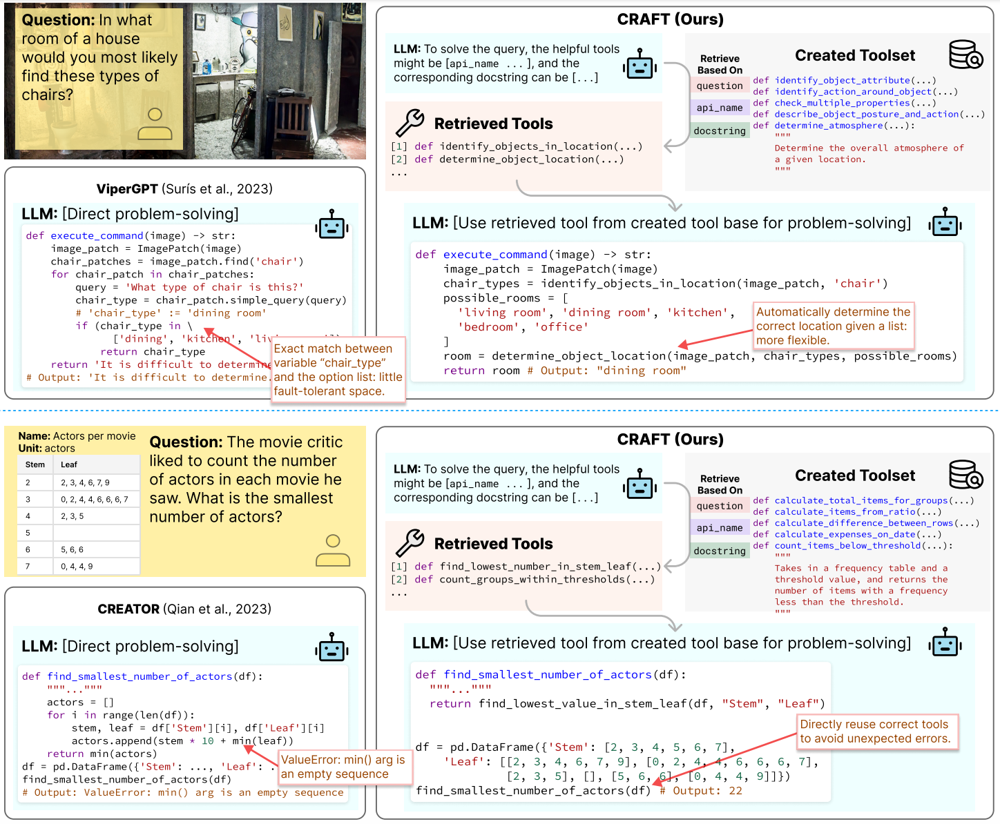
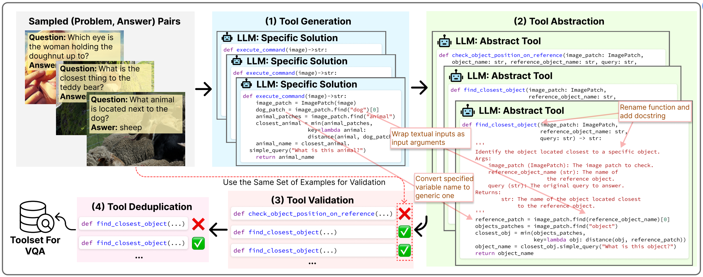

Code for paper ["CRAFT: Customizing LLMs by Creating and Retrieving from Specialized Toolsets"](https://arxiv.org/abs/2309.17428) 


# Overview
Previous approaches directly solve the given problem by generating code solutions, which may contain errors. CRAFT first creates a toolset that contains diverse, reusable, and correct tools that are executable code snippets. During inference, CRAFT employs a multi-view matching approach, incorporating information about the target problem, API names, and docstrings, to identify and utilize relevant tools, enhancing its problem-solving capabilities. 



# Tool Creation
In toolset creation, we apply an iterative problem-sampling strategy based on similarity for diversity, followed by generating code solutions using GPT-4. To ensure the reusability of the created tools, we abstract the specific solutions into high-level tools that can tackle various kinds of problems by instructing GPT-4. To ensure the tools' correctness, we evaluate the tools on the original problems and discard those outputting incorrect answers. Finally, we deduplicate the tools to reduce redundancy, and finally obtain a toolset. 



# Tool Retrieval
In inference, we apply a multi-view matching algorithm regarding the target problem, function name, and docstring between those in the toolset to retrieve related tools.

# How to Use
There are two folders in this repository, `vqa` and `tab_and_math`, representing three tasks considered in the paper: VQA, tabular processing, and mathematics reasoning. VQA is implemented based on [ViperGPT](https://github.com/cvlab-columbia/viper), and the other two are built on [CREATOR](https://arxiv.org/abs/2305.14318). 

For VQA, `cd vqa` and then follow the guidance in [ViperGPT](https://github.com/cvlab-columbia/viper) to install the environment and download necessary models. Run `construct_toolset.py` to create VQA-specific tool functions and run `run_exp.py` to solve downstream problems with retrieval.

For the other two tasks, `cd tab_and_math` and install the environment by running `pip install -r requirements.txt`. The code for toolset construction is in `construct_toolset.py`, and the code for running experiments on downstream datasets is in `generate_with_retrieval.py`.

# Citation
Please kindly cite our paper if you find our method or code useful:
```
@article{yuan2023revisiting,
      title={CRAFT: Customizing LLMs by Creating and Retrieving from Specialized Toolsets}, 
      author={Yuan, Lifan and Chen, Yangyi and Wang, Xingyao and Fung, Yi R. and Peng, Hao and Ji, Heng},
      journal={arXiv preprint arXiv:2309.17428},
      year={2023}
}
```

